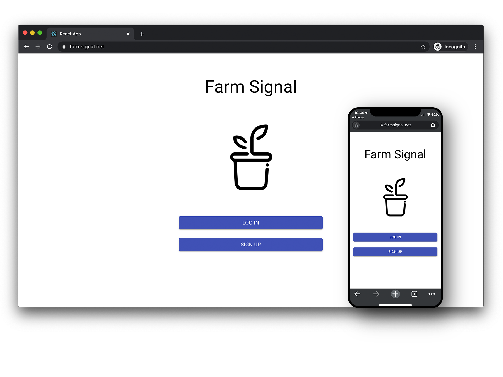
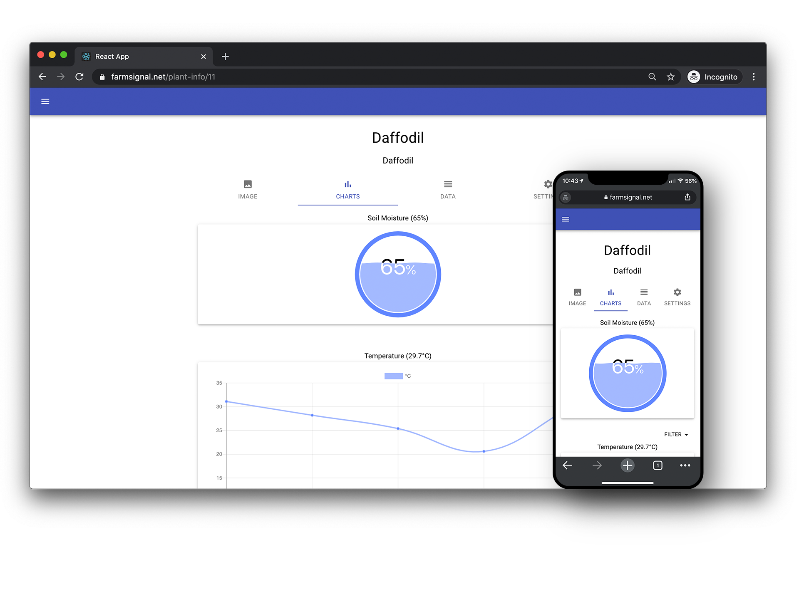
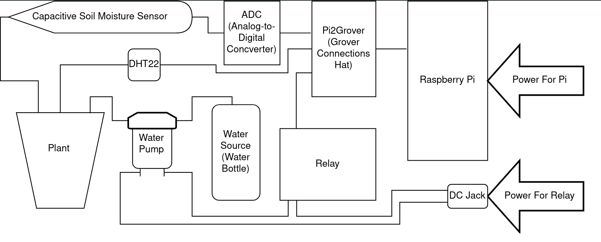
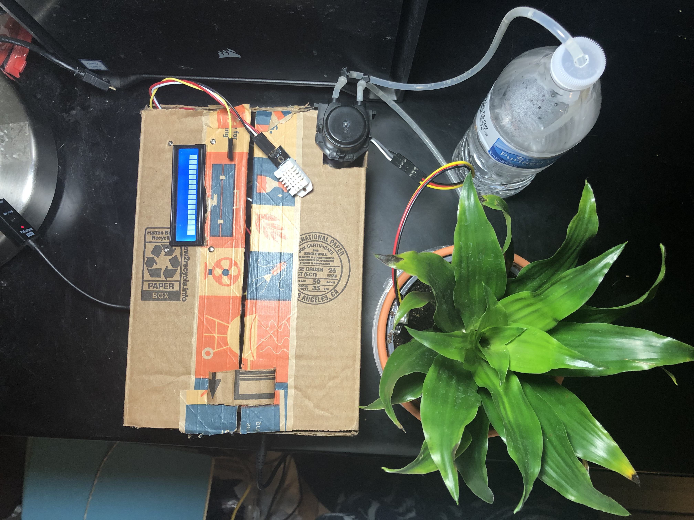
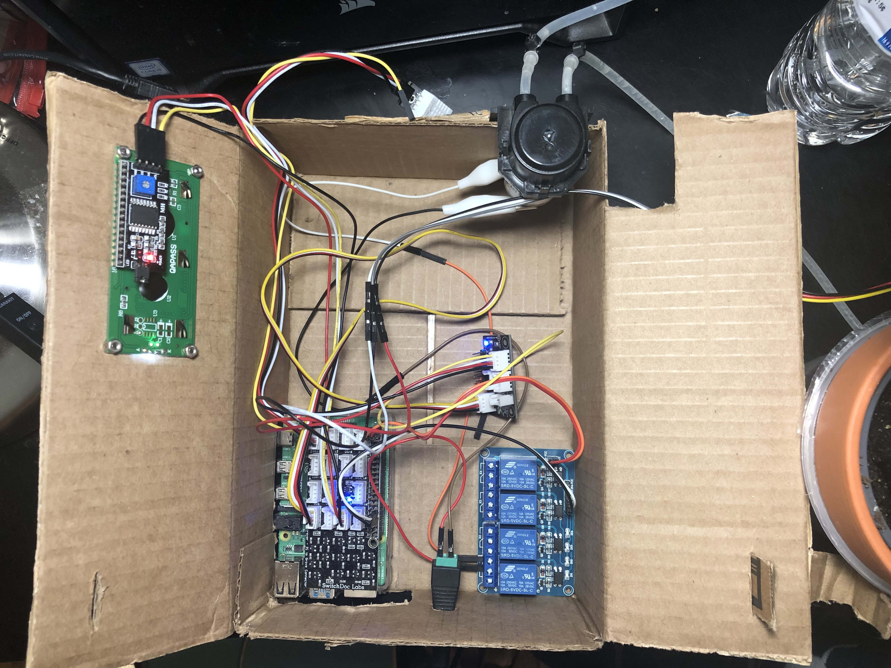

# FarmSignal

An open-source, easy-to-use automated plant watering solution.

## Get Started
- [Learn more about FarmSignal](https://www.sandbox.csun.edu/~ajc60058/)
- [Hardware required](https://farmsignal.readthedocs.io/en/latest/overview/prerequisites.html)
- [How to assemble system](https://farmsignal.readthedocs.io/en/latest/assembly/hardware.html)
- [Read our documentation](https://farmsignal.readthedocs.io/en/latest/index.html)
- [Watch assembly videos](https://www.youtube.com/watch?v=xMBV64GCkpA&list=PLiWFbkxE08WsIBoiFEdOXkTn2Xg36TSrN)

## Images

